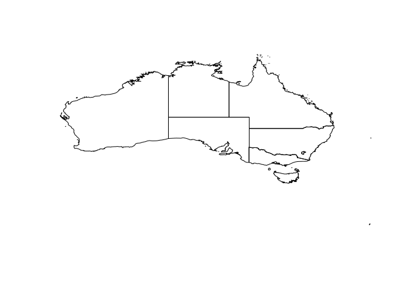
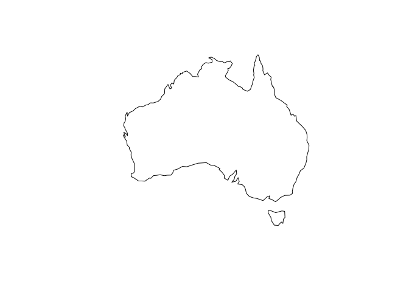
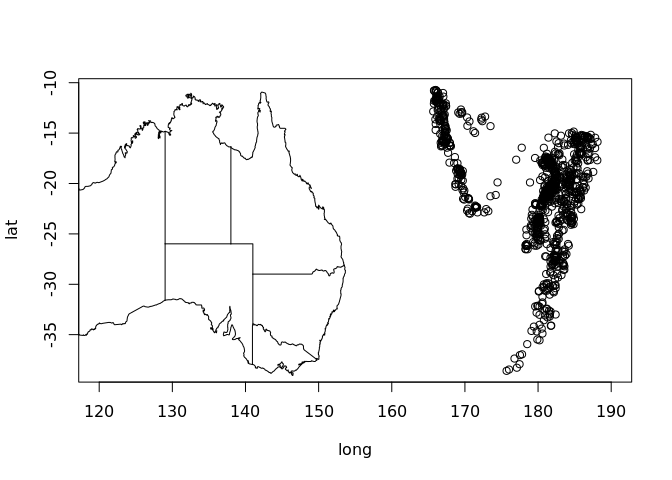
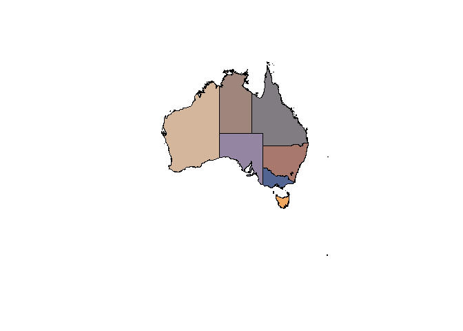
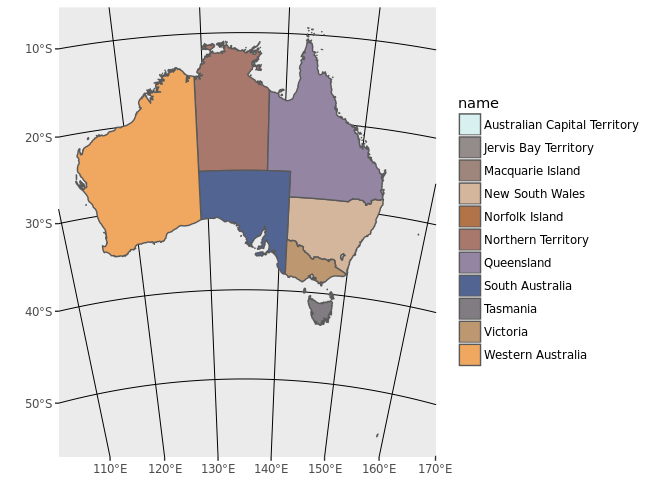
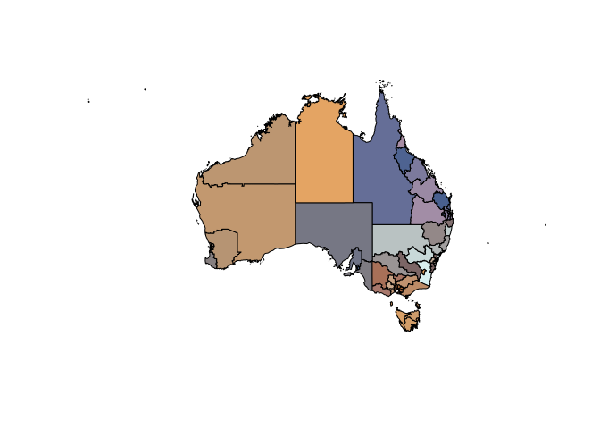
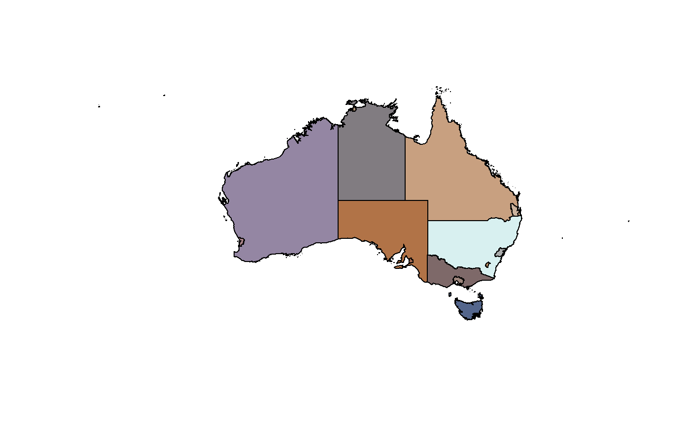

<!-- README.md is generated from README.Rmd. Please edit that file -->

[](https://travis-ci.org/mdsumner/ozmaps)
[](https://travis-ci.org/mdsumner/ozmaps)
[](https://ci.appveyor.com/project/mdsumner/ozmaps)
[](https://cran.r-project.org/package=ozmaps)
 [](https://codecov.io/github/mdsumner/ozmaps?branch=master)

# Overview

The goal of ozmaps is to get maps of Australia to plot\!

# Installation

ozmaps may be installed directly from github.

``` r
devtools::install_github("mdsumner/ozmaps")
```

The package includes some *simple features* data, which can be used
independently of ozmaps with the ‘sf’ package. If required, install `sf`
from CRAN.

``` r
install.packages("sf")
```

## Usage

Plot Australia with states.

``` r
library(ozmaps)
ozmap()
```



Plot Australia without states.

``` r
ozmap(states = FALSE)
#> Warning in ozmap(states = FALSE): states argument is deprecated, see
#> 'oz::oz()' function
```



Add to an existing plot.

``` r
plot(quakes[c("long", "lat")], xlim = c(120, 190))
ozmap(add = TRUE)
```



Obtain the data used in `sf` form.

``` r
sf_oz <- ozmap_data("states")
#> returning `sf` data format
#>  to use/plot ensure `sf` package is installed, then `library(sf)`

tibble::as_tibble(sf_oz)
#> # A tibble: 11 x 4
#>    name          type    adm1_code                                 geometry
#>    <chr>         <chr>   <chr>                           <MULTIPOLYGON [°]>
#>  1 Macquarie Is… <NA>    AUS+00?   (((158.8657 -54.74993, 158.8382 -54.750…
#>  2 Jervis Bay T… Territ… AUS-1932  (((150.6131 -35.18727, 150.6364 -35.144…
#>  3 Northern Ter… Territ… AUS-2650  (((136.6955 -15.73992, 136.6636 -15.778…
#>  4 Western Aust… State   AUS-2651  (((122.2469 -34.16245, 122.2379 -34.163…
#>  5 Australian C… Territ… AUS-2653  (((149.3818 -35.34875, 149.367 -35.3573…
#>  6 New South Wa… State   AUS-2654  (((150.7038 -35.12044, 150.6735 -35.124…
#>  7 South Austra… State   AUS-2655  (((137.6229 -35.58213, 137.6343 -35.590…
#>  8 Victoria      State   AUS-2656  (((146.4898 -38.7457, 146.5347 -38.7559…
#>  9 Queensland    State   AUS-2657  (((153.4873 -27.41522, 153.5011 -27.417…
#> 10 Norfolk Isla… Territ… AUS-2659  (((159.0689 -31.52093, 159.0833 -31.534…
#> 11 Tasmania      State   AUS-2660  (((147.364 -43.37933, 147.3655 -43.3878…
```

Plot with a custom palette.

``` r
##remotes::install_github("ropenscilabs/ochRe")
library(sf)
nmjr <- ochRe::ochre_pal()(dim(sf_oz)[1])
plot(st_geometry(sf_oz), col = nmjr)
```



``` r

## soon...plot directly with ggplot2
library(ggplot2)
ggplot(sf_oz, aes(fill = name)) + geom_sf() + coord_sf(crs = "+proj=lcc +lon_0=135 +lat_0=-30 +lat_1=-10 +lat_2=-45 +datum=WGS84") + scale_fill_manual(values = nmjr)
```



Plot the ABS layers (from 2016).

``` r

ozmap("abs_ced", col = ochRe::ochre_pal()(nrow(abs_ced)))
```



``` r


ozmap("abs_ste", col = ochRe::ochre_pal()(nrow(abs_ste)))
```



Please note that the ‘ozmaps’ project is released with a [Contributor
Code of Conduct](CODE_OF_CONDUCT.md). By contributing to this project,
you agree to abide by its terms.
