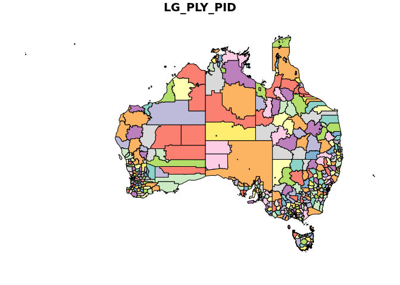
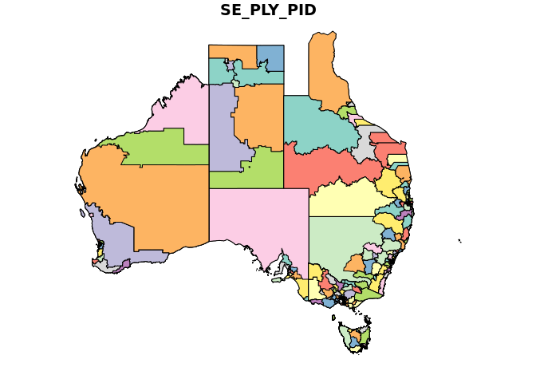
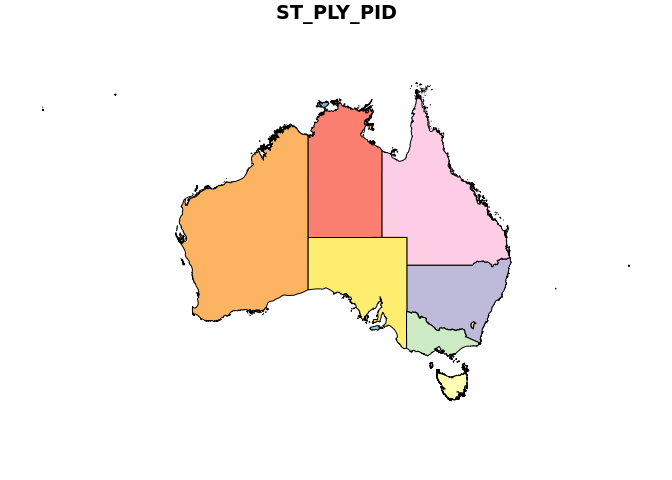
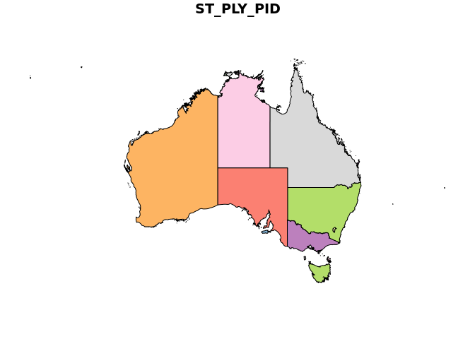

<!-- README.md is generated from README.Rmd. Please edit that file -->
ozplot
======

The goal of ozplot is to get maps of Australia to plot!

Obtain a set of shapefiles
--------------------------

This block of code will download a ~1.5Gb zip file with many shapefiles in nested folders. I originally chose the MapInfo format, but those had empty geometries(!).

``` r
#f <- "https://data.gov.au/dataset/bdcf5b09-89bc-47ec-9281-6b8e9ee147aa/resource/cb2d6c1c-fd4c-4fd7-b93b-3796425bc0de/download/aug17adminboundsmapinfotabformat20170828133827.zip"
f <- "https://data.gov.au/dataset/bdcf5b09-89bc-47ec-9281-6b8e9ee147aa/resource/53c24b8e-4f55-4eed-a189-2fc0dcca6381/download/aug17adminboundsesrishapefileordbffile20170821151234.zip"
download.file(f, basename(f), mode = "wb")
unzip(basename(f))
```

I discovered these links (ESRI Shapefile and MapInfo) at this site: <https://data.gov.au/dataset/psma-administrative-boundaries> . Build a data frame of the available file names, it's a recursive tree of directories but we only need the ".shp$" values.

``` r
library(dplyr)
fs <- tibble::tibble(fullname = list.files(".", recursive = TRUE, pattern = "shp$"))

## keep file and fullname, a habit of mine
fs <- fs %>% dplyr::mutate(file = basename(fullname)) %>% dplyr::select(file, fullname)

fs 
#> # A tibble: 261 x 2
#>    file                           fullname                                
#>    <chr>                          <chr>                                   
#>  1 ACT_GCCSA_2011_POLYGON_shp.shp AUG17_AdminBounds_ESRIShapefileorDBFfil…
#>  2 ACT_MB_2011_POLYGON_shp.shp    AUG17_AdminBounds_ESRIShapefileorDBFfil…
#>  3 ACT_SA1_2011_POLYGON_shp.shp   AUG17_AdminBounds_ESRIShapefileorDBFfil…
#>  4 ACT_SA2_2011_POLYGON_shp.shp   AUG17_AdminBounds_ESRIShapefileorDBFfil…
#>  5 ACT_SA3_2011_POLYGON_shp.shp   AUG17_AdminBounds_ESRIShapefileorDBFfil…
#>  6 ACT_SA4_2011_POLYGON_shp.shp   AUG17_AdminBounds_ESRIShapefileorDBFfil…
#>  7 NSW_GCCSA_2011_POLYGON_shp.shp AUG17_AdminBounds_ESRIShapefileorDBFfil…
#>  8 NSW_MB_2011_POLYGON_shp.shp    AUG17_AdminBounds_ESRIShapefileorDBFfil…
#>  9 NSW_SA1_2011_POLYGON_shp.shp   AUG17_AdminBounds_ESRIShapefileorDBFfil…
#> 10 NSW_SA2_2011_POLYGON_shp.shp   AUG17_AdminBounds_ESRIShapefileorDBFfil…
#> # ... with 251 more rows

## read all files and bind together in one object
## (I find problems using map_df so I just avoid it
## and ensure sf is attached)
read_psma <- function(x) {
  library(sf)
  do.call(rbind, purrr::map(x, sf::read_sf))
}
```

``` r
## ignore state and see what layers there are
## there are 32 different kinds of layers
sort(unique(unlist(lapply(strsplit(fs$file, "_"), function(x) paste(tail(x, -1), collapse = "_")))))
#>  [1] "COMM_ELECTORAL_POLYGON_shp.shp"  "GCCSA_2011_POLYGON_shp.shp"     
#>  [3] "GCCSA_2016_POLYGON_shp.shp"      "IARE_2011_POLYGON_shp.shp"      
#>  [5] "IARE_2016_POLYGON_shp.shp"       "ILOC_2011_POLYGON_shp.shp"      
#>  [7] "ILOC_2016_POLYGON_shp.shp"       "IREG_2011_POLYGON_shp.shp"      
#>  [9] "IREG_2016_POLYGON_shp.shp"       "LGA_POLYGON_shp.shp"            
#> [11] "LOCALITY_POLYGON_shp.shp"        "MB_2011_POLYGON_shp.shp"        
#> [13] "MB_2016_POLYGON_shp.shp"         "REMOTENESS_2011_POLYGON_shp.shp"
#> [15] "SA1_2011_POLYGON_shp.shp"        "SA1_2016_POLYGON_shp.shp"       
#> [17] "SA2_2011_POLYGON_shp.shp"        "SA2_2016_POLYGON_shp.shp"       
#> [19] "SA3_2011_POLYGON_shp.shp"        "SA3_2016_POLYGON_shp.shp"       
#> [21] "SA4_2011_POLYGON_shp.shp"        "SA4_2016_POLYGON_shp.shp"       
#> [23] "SOS_2011_POLYGON_shp.shp"        "SOSR_2011_POLYGON_shp.shp"      
#> [25] "STATE_ELECTORAL_POLYGON_shp.shp" "STATE_POLYGON_shp.shp"          
#> [27] "SUA_2011_POLYGON_shp.shp"        "TOWN_POINT_shp.shp"             
#> [29] "UCL_2011_POLYGON_shp.shp"        "WARD_POLYGON_shp.shp"
```

No we can filter on the state-removed strings to get the entire set for the country.

``` r
## all LGA
lga <- read_psma(fs %>% dplyr::filter(grepl("LGA_POLYGON", file)) %>% dplyr::pull(fullname))

## note that the "geometry" column is sticky, we
## subset like this to avoid faceting on all columns
plot(lga[1])
```



``` r

## electoral
elec <- read_psma(fs %>% dplyr::filter(grepl("STATE_ELECTORAL_POLYGON", file)) %>% dplyr::pull(fullname))

plot(elec[1])
```



``` r

## state
state <- read_psma(fs %>% dplyr::filter(grepl("STATE_POLYGON", file)) %>% dplyr::pull(fullname))
plot(state[1])
abline(v = 148, h = -43)
```



``` r

## that is very high resolution, checkout 
plot(state[1], xlim = c(147.7, 148.2), ylim = c(-43.3, -43.0))
```


``` r

pryr::object_size(state)
#> 33.8 MB

## use rmapshaper for topological simplification
## (but avoid date columns which trigger a bug in 0.3.0)
simple_state <- rmapshaper::ms_simplify(state[c("ST_PLY_PID", "STATE_PID", "geometry")])
pryr::object_size(simple_state)
#> 3.44 MB
plot(simple_state[1], xlim = c(147.7, 148.2), ylim = c(-43.3, -43.0))
```


``` r
plot(simple_state[1])
```


