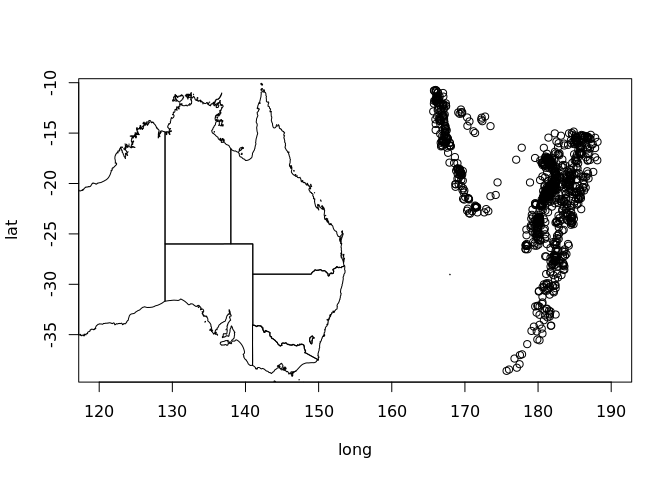
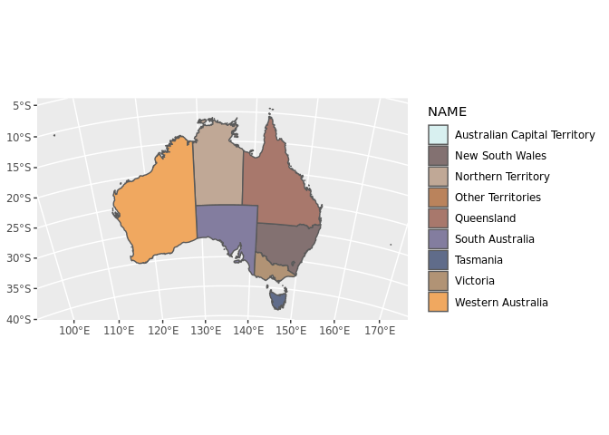
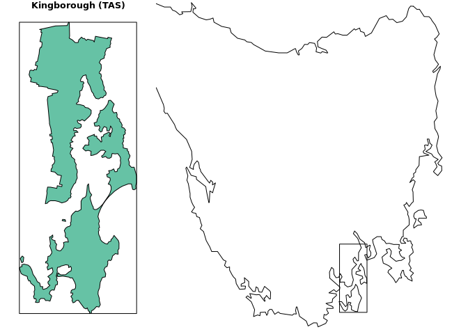

<!-- README.md is generated from README.Rmd. Please edit that file -->

[](https://travis-ci.org/mdsumner/ozmaps)
[](https://travis-ci.org/mdsumner/ozmaps)
[](https://ci.appveyor.com/project/mdsumner/ozmaps)
[](https://cran.r-project.org/package=ozmaps)
 [](https://codecov.io/github/mdsumner/ozmaps?branch=master)

# Overview

The goal of ozmaps is to get maps of Australia to plot\!

# Installation

Install from CRAN with

``` r
install.packages("ozmaps")
```

The development version of ozmaps may be installed directly from github.

``` r
devtools::install_github("mdsumner/ozmaps")
```

The package includes some *simple features* data, which can be used
independently of ozmaps with the ‘sf’ package. If required, install `sf`
from CRAN.

``` r
install.packages("sf")
```

## Usage

Plot Australia with states.

``` r
library(ozmaps)
ozmap()
```


Plot Australia without states.

``` r
ozmap(x = "country")
```


Add to an existing plot.

``` r
plot(quakes[c("long", "lat")], xlim = c(120, 190))
ozmap(add = TRUE)
```



Obtain the data used in `sf` form.

``` r
sf_oz <- ozmap_data("states")

tibble::as_tibble(sf_oz)
#> # A tibble: 9 x 2
#>   NAME                                                             geometry
#>   <chr>                                                  <MULTIPOLYGON [°]>
#> 1 New South Wales     (((150.7016 -35.12286, 150.6611 -35.11782, 150.6373 …
#> 2 Victoria            (((146.6196 -38.70196, 146.6721 -38.70259, 146.6744 …
#> 3 Queensland          (((148.8473 -20.3457, 148.8722 -20.37575, 148.8515 -…
#> 4 South Australia     (((137.3481 -34.48242, 137.3749 -34.46885, 137.3805 …
#> 5 Western Australia   (((126.3868 -14.01168, 126.3625 -13.98264, 126.3765 …
#> 6 Tasmania            (((147.8397 -40.29844, 147.8902 -40.30258, 147.8812 …
#> 7 Northern Territory  (((136.3669 -13.84237, 136.3339 -13.83922, 136.3532 …
#> 8 Australian Capital… (((149.2317 -35.222, 149.2346 -35.24047, 149.2716 -3…
#> 9 Other Territories   (((167.9333 -29.05421, 167.9188 -29.0344, 167.9313 -…
```

Plot with a custom palette.

``` r
library(sf)
if (utils::packageVersion("paletteer") < '1.0.0') {
 pal <- paletteer::paletteer_d(package = "ochRe", palette = "namatjira_qual")
} else {
  pal <- paletteer::paletteer_d(palette = "ochRe::namatjira_qual")
} 
opal <- colorRampPalette(pal)
nmjr <- opal(nrow(sf_oz))
plot(st_geometry(sf_oz), col = nmjr)
```


``` r

## plot directly with ggplot2
library(ggplot2)
ggplot(sf_oz, aes(fill = NAME)) + geom_sf() + coord_sf(crs = "+proj=lcc +lon_0=135 +lat_0=-30 +lat_1=-10 +lat_2=-45 +datum=WGS84") + scale_fill_manual(values = nmjr)
```



Plot the ABS layers (from 2016).

``` r
ozmap("abs_ced", col = opal(nrow(abs_ced)))
```


``` r


ozmap("abs_ste", col = opal(nrow(abs_ste)))
```


## Resolution

These ABS layers `abs_ced`, `abs_lga`, and `abs_ste` are derived from
the 2016 sources and simplified using `rmapshaper::ms_simplify(, keep
= 0.05, keep_shapes = TRUE)` so all the original polygons are there.
There is sufficient detail to map many (most?) of the regions on their
own, which was a major goal for this package.

The cache of the source data at original resolution is available in
[ozmaps.data](https://github.com/mdsumner/ozmaps.data/).

Compare the detail of Bruny Island here in this box, compared with the
very basic maps package layer.

``` r
library(dplyr)
kbor <- abs_lga %>% dplyr::filter(grepl("Kingborough", NAME))
bb <- st_bbox(kbor)

layout(matrix(c(1, 1, 1, 2, 2, 2, 2, 2, 2), nrow = 3))
plot(kbor, reset = FALSE, main = "Kingborough (TAS)")
rect(bb["xmin"], bb["ymin"], bb["xmax"], bb["ymax"])
library(mapdata)
#> Loading required package: maps
par(mar = rep(0, 4))
plot(c(145, 148.5), c(-43.6, -40.8), type = "n", asp = 1/cos(mean(bb[c(2, 4)]) * pi/180), axes = FALSE, xlab = "", ylab = "")
maps::map(database = "worldHires", regions = "australia", xlim = c(145, 148.5), ylim = c(-43.6, -40.8), add = TRUE)
rect(bb["xmin"], bb["ymin"], bb["xmax"], bb["ymax"])
```



-----

Please note that the ‘ozmaps’ project is released with a [Contributor
Code of
Conduct](https://github.com/mdsumner/ozmaps/blob/master/CODE_OF_CONDUCT.md).
By contributing to this project, you agree to abide by its terms.
